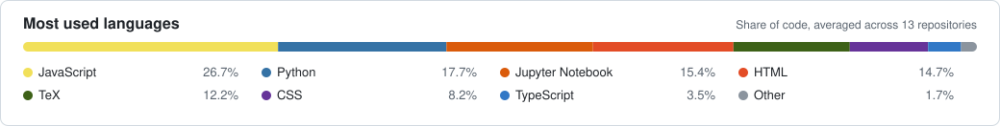

<h1 align="center">Hi, I'm Harsh Raj 👋</h1>

  

  
  
  
  

- 🎓 Studying for an **MS in Financial Engineering at NYU Tandon**, and looking for **finance internships**.
- 🏦 Previously **Assistant Manager at Bank of America**, building regulatory risk reporting (FRTB, FR VaR) and ETL automation. Before that, Business Operations at **ZS Associates**.
- ⚡ Automated one reporting process that saved **150+ hours a month**.
- 📝 Published in **IEEE Xplore (2023)**: *Reducing Cloud Workload Costs in Geographically Distributed Data Centers with GeoSched*.
- 🎮 Outside finance: anime, Counter-Strike 2, and turning both into data projects (see below).

### 📈 Finance research, with live tools

Each has a working dashboard and a paper in Springer Nature journal format.

| Project | What it answers | |
| --- | --- | --- |
| **[Home loans in India](https://github.com/harsh-github007/Mortgage-Loans-in-India)** | What a home loan really costs before, during and after COVID, and how much prepaying, rate changes and tax change it | [Calculator](https://harsh-github007.github.io/Mortgage-Loans-in-India/) · [Paper](https://github.com/harsh-github007/Mortgage-Loans-in-India/blob/main/research/home-loans-in-india.pdf) |
| **[FDI and ownership](https://github.com/harsh-github007/FDI-and-Changing-Dimensions-of-Ownership)** | Why India's record FDI inflows leave so little behind, and how foreign-ownership limits changed from 1991 to 2026 | [Dashboard](https://harsh-github007.github.io/FDI-and-Changing-Dimensions-of-Ownership/) · [Paper](https://github.com/harsh-github007/FDI-and-Changing-Dimensions-of-Ownership/blob/main/research/fdi-and-changing-dimensions-of-ownership.pdf) |
| **[Gaming M&A](https://github.com/harsh-github007/Gaming-MA-Financial-Performance)** | Did Take-Two–Zynga, EA's 2021 deals, Unity–ironSource and Nazara pay off? Mostly not, according to their own financials | [Dashboard](https://harsh-github007.github.io/Gaming-MA-Financial-Performance/) · [Paper](https://github.com/harsh-github007/Gaming-MA-Financial-Performance/blob/main/research/gaming-ma-financial-performance.pdf) |
| **[Crypto market monitor](https://github.com/harsh-github007/Digital-Currency)** | Live prices and a year of risk (volatility, drawdown, beta to Bitcoin) for the 30 largest cryptocurrencies | [Live site](https://harsh-github007.github.io/Digital-Currency/) |

### 🧪 Data projects

- **[Anime review sentiment](https://github.com/harsh-github007/Anime-Reviews-Sentimental-Analysis):** can a sentiment model tell whether a MyAnimeList review recommends the show? Checked against the reviewers' own verdicts, and refreshed every month.
- **[Toxicity in Indian esports YouTube](https://github.com/harsh-github007/Identifying-Toxicity-Within-Esports-YouTube-Channels):** 10,000+ comments from India's biggest gaming channels, with toxicity rates corrected for how often the detector is wrong.
- **[Bank customer churn](https://github.com/harsh-github007/Analysis_Churn):** who leaves a bank across 28,000 customers, and why the obvious explanations don't hold.
- **[Super Retailer](https://github.com/harsh-github007/Super-Retailer):** a five-page Power BI sales report for two clothing chains.

### 🛠️ Tools

- **[CS2 Inventory Exporter](https://github.com/harsh-github007/cs2-inventory-exporter):** export any public Counter-Strike 2 inventory to CSV, with wear, rarity and trade status. [Live app](https://cs2-inventory-exporter-auxo.vercel.app/)
- **[Sort Bench](https://github.com/harsh-github007/sorting-aglo-visualization):** watch nine sorting algorithms step by step, rewind them, and race two on the same input. [Live demo](https://harsh-github007.github.io/sorting-aglo-visualization/)
- **[Banking System](https://github.com/harsh-github007/Banking-System):** a UML design for a retail bank's core system, in nine Mermaid diagrams.

### 🧰 Tools I work with

  
  
  
  
  
  
  
  
  
  

 

<picture>
  <source media="(prefers-color-scheme: dark)" srcset="assets/languages-card-dark.svg" />
  
</picture>
